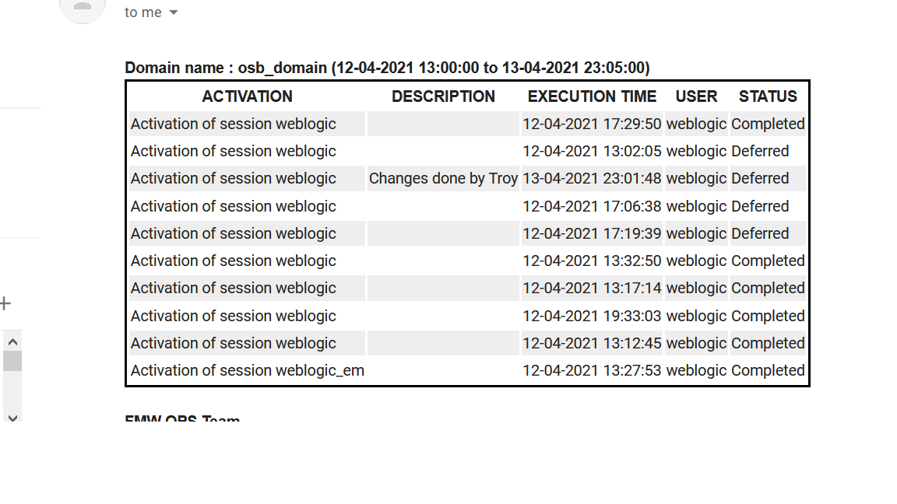

# OsbActivationHistory
Oracle Service Bus get activation histroy using JMX and email the data.

This project is to fetch Activation History from OSB using JMX and send data using java email.
Execute 'run.cmd' or 'run.sh' as per environemnt. 

Example of Osb Portal data.

Sample email sent by this utility.

All configuration are store in 'config.properties'. SMTP properties are define once.
Multiple OSB environment/domain can be configured by repeating wls setting for each domain. Utility connects to each domains and comiple data in one email. 
